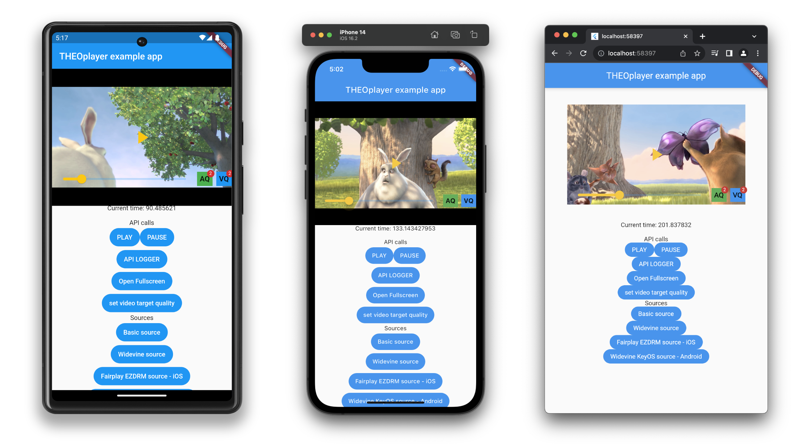

# THEOplayer Flutter SDK

## THEOplayer Flutter SDK - Join the Early Access Program

THEOplayer Flutter SDK is currently **available through our [Early Access Program](https://www.theoplayer.com/flutter-video-player-sdk)**.

Anyone is **free to join** the Early Access Program.

### Why the Early Access Program?
- Being part of the Early Access Program allows you to **experience and utilize new features before they are available to the general public**.
-  An opportunity to **provide feedback directly to the developers**. This means you can **influence the development of the SDK, suggesting features or improvements** that would benefit you and other users.
-  The Early Access Program provides **dedicated support**. This can be a valuable resource for learning and troubleshooting, as you'll have **direct access video playback experts**.

## Getting started

This repository provides a sneak peek of the THEOplayer Flutter SDK.

You can get insight on:

- the architecture
- the THEOplayer APIs
- supported features
- how easy to build a cross-platform video player app with THEOplayer
- how to combine native THEOplayer SDK features with the THEOplayer Flutter SDK
- ... and many more!

### [START HERE](./GETTING_STARTED.md)

## Join the Early Access Program!
Do you like what you have seen so far?

You can try it out immediately.

[Join the Early Access Program](https://www.theoplayer.com/flutter-video-player-sdk) and you can get access to the THEOplayer Flutter SDK today!