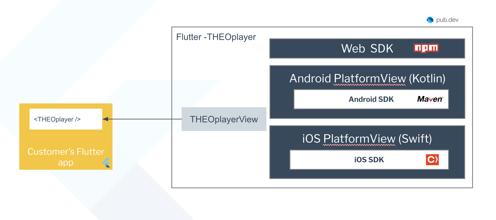

# THEOplayer Flutter SDK Architecture

This document describes how the THEOplayer Flutter SDK is structured internally: how the packages relate to each other, how Dart talks to the native players, and how video is rendered on each platform.



## Overview

The THEOplayer Flutter SDK is a **federated Flutter plugin** that wraps the native THEOplayer SDKs. It does **not** reimplement playback — every platform embeds the real native player:

| Platform | Native SDK source |
|----------|-------------------|
| Android | `com.theoplayer.theoplayer-sdk-android:core` (Maven: `https://maven.theoplayer.com/releases`) |
| iOS | `THEOplayerSDK-core` + `THEOplayer-Integration-THEOlive` (CocoaPods) |
| Web | `THEOplayer.chromeless.js` (shipped manually in your app's `web/` folder) |

The Flutter SDK version is **locked to the native player version** (e.g. Flutter SDK `10.12.3` uses native SDKs `10.12.3` on all platforms).

## Package structure

The repository is a [Melos](https://melos.invertase.dev) monorepo containing the packages of a standard [federated plugin](https://docs.flutter.dev/packages-and-plugins/developing-packages#federated-plugins) setup:

| Path | Package | Description |
|------|---------|-------------|
| `flutter_theoplayer_sdk/flutter_theoplayer_sdk/` | `theoplayer` | App-facing package, public API |
| `flutter_theoplayer_sdk/flutter_theoplayer_sdk_platform_interface/` | `theoplayer_platform_interface` | Contracts, Pigeon definitions, event system, shared mobile controller |
| `flutter_theoplayer_sdk/flutter_theoplayer_sdk_android/` | `theoplayer_android` | Dart glue + Kotlin native plugin |
| `flutter_theoplayer_sdk/flutter_theoplayer_sdk_ios/` | `theoplayer_ios` | Dart glue + Swift native plugin |
| `flutter_theoplayer_sdk/flutter_theoplayer_sdk_web/` | `theoplayer_web` | Dart ⇄ JS interop (`dart:js_interop`, no Pigeon) |
| `flutter_theoplayer_sdk/flutter_theoplayer_sdk/example/` | - | Demo app, hosts all integration tests |

## Layer diagram

```
Your app
   |
THEOplayer (facade) ----> PlayerState (event-fed cache => synchronous getters)
   |
THEOplayerView (StatefulWidget)
   |  initState -> TheoplayerPlatform.instance.initalize()
   |  build     -> TheoplayerPlatform.instance.buildView()
   |
TheoplayerPlatform (federated, self-registration via registerWith())
   |-- THEOplayerAndroid -> PlatformViewLink / Texture -> Kotlin THEOplayerViewNative
   |-- THEOplayerIOS     -> UiKitView                  -> Swift THEOplayerViewNative
   |-- TheoplayerWeb     -> HtmlElementView (div)      -> THEOplayerJS (js_interop)
   |
THEOplayerViewController (per-player; Mobile impl shared by Android+iOS, Web separate)
   |
   |-- Android + iOS: Pigeon channels (channel suffix "id_<playerId>" => multi-player support) <-> native bridges
   |-- Web:           direct JS calls via dart:js_interop (no Pigeon)
```

### Key classes

| Component | Location |
|-----------|----------|
| `THEOplayer` facade class | `flutter_theoplayer_sdk/lib/src/theoplayer_internal.dart` |
| `PlayerState` (event-fed cache) | `flutter_theoplayer_sdk/lib/src/theoplayer_state.dart` |
| `THEOplayerView` widget | `flutter_theoplayer_sdk/lib/src/theoplayer_view.dart` |
| `TheoplayerPlatform` | `..._platform_interface/lib/theoplayer_platform_interface.dart` |
| `THEOplayerViewController` contract | `..._platform_interface/lib/theoplayer_view_controller_interface.dart` |
| Shared mobile controller | `..._platform_interface/lib/theoplayer_view_controller_mobile.dart` |
| Pigeon definitions (source of truth) | `..._platform_interface/pigeons/` |
| Android native entry | `..._android/android/src/main/kotlin/com/theoplayer/flutter/TheoplayerPlugin.kt` |
| Android player wrapper | `..._android/.../THEOplayerViewNative.kt` |
| iOS native entry | `..._ios/ios/Classes/TheoplayerPlugin.swift` |
| Web JS interop bindings | `..._web/lib/theoplayer_api_web.dart` |

## Dart ⇄ native communication

The mobile platforms communicate through [Pigeon](https://pub.dev/packages/pigeon)-generated, type-safe channels:

- `THEOplayerNativeAPI` (`@HostApi`): Dart → native calls (play, pause, setSource, ...).
- `THEOplayerFlutterAPI` (`@FlutterApi`): native → Dart events.
- Dedicated bridge APIs for text/audio/video tracks, THEOlive, ABR and debug flags.

Every channel name is suffixed with `id_<playerId>` through `PigeonBinaryMessengerWrapper` (available in Dart, Kotlin and Swift), which is what allows **multiple player instances** to coexist.

The **Web** implementation bypasses Pigeon entirely: `theoplayer_api_web.dart` binds to the THEOplayer Web SDK via `dart:js_interop`, and `transformers_web.dart` converts JS objects into the same model classes, so the upper layers stay platform-agnostic.

See [CONTRIBUTING.md](../CONTRIBUTING.md) for the Pigeon code generation workflow and a step-by-step guide for adding new cross-platform features.

### Event and state flow

```
native player event
  -> PlayerEventForwarder (.kt / .swift) or player_event_forwarder_web.dart
  -> THEOplayerFlutterAPI (pigeon channel, suffixed) / JS event listener
  -> THEOplayerFlutterAPIImpl
  -> EventManager
  -> PlayerState (cache update) + user addEventListener callbacks
```

`PlayerState` subscribes to player events and caches values like `currentTime`, `duration` and `readyState`. **This is why getters on `THEOplayer` are synchronous** even though the underlying channel calls are asynchronous.

### Native bridge pattern

Each API domain gets its own bridge, instantiated per player in `THEOplayerViewNative` (Kotlin and Swift mirror each other almost 1:1):

- `PlayerEventForwarder` — core player events
- `TextTrackBridge`, `AudioTrackBridge`, `VideoTrackBridge` — track lists, track events, selection
- `THEOliveBridge` — THEOlive-specific events/API
- `AbrBridge` — ABR configuration
- `DebugFlagsBridge` — native debug logging control
- `transformers/` — pigeon ⇄ native model conversion

## Rendering

### Android: view composition modes

Selected via `AndroidConfig.viewComposition` (`AndroidViewComposition` enum):

| Mode | Mechanism | Type | Notes |
|------|-----------|------|-------|
| `HYBRID_COMPOSITION` | `initExpensiveAndroidView` | PlatformView | Legacy default (`AndroidConfig()`) |
| `TEXTURE_LAYER` | `initAndroidView` | PlatformView | Virtual-display style |
| `SURFACE_TEXTURE` | Flutter `Texture` + `TextureRegistry.createSurfaceTexture()` | Texture | Default for `AndroidConfig.create()` |
| `SURFACE_PRODUCER` | Flutter `Texture` + `TextureRegistry.createSurfaceProducer()` | Texture | Impeller-compatible (Flutter ≥ 3.22) |

**Texture mode flow** (`SURFACE_TEXTURE` / `SURFACE_PRODUCER`):

1. `THEOplayerView.initState` → `TheoplayerPlatform.initalize()` → `PlatformPlayersService.createPlayer()` over the `com.theoplayer.global/players` method channel.
2. `TheoplayerPlugin.onMethodCall("createPlayer")` creates a texture entry and a **headless** `THEOplayerViewNative` (no platform view); returns the texture id.
3. Dart builds a `Texture(textureId)` widget (through `TextureManager`, which mimics the `PlatformViewLink` lifecycle).
4. `THEOplayerViewControllerAndroid.configureSurface()` → native `player.setCustomSurface(surface, w, h)`.

Caveat of texture modes: in-stream subtitles are **not** rendered — subtitle rendering must be implemented app-side using text track events.

**PlatformView mode flow**: `initalize()` is a no-op; `buildView()` creates a `PlatformViewLink`/`AndroidViewSurface`; the player is constructed by `THEOplayerViewNativeFactory` when the platform view is created.

### iOS

Single path: `UiKitView` with view type `com.theoplayer/theoplayer-view-native`; `THEOplayerNativeViewFactory` is registered in `TheoplayerPlugin.swift`.

### Web

- `TheoplayerWeb` registers a view factory producing a wrapper `<div>` with a generated unique id; `THEOplayerViewControllerWeb` constructs `THEOplayerJS` on it directly.
- Your app must ship `THEOplayer.chromeless.js` (plus the `theoplayer.d/e/p.js` worker files) in `web/`; `WebConfig.libraryLocation` must point to the worker location (required for HLS playback).
- The implementation is WASM-compatible (`dart:js_interop` + `package:web`), see [wasm_support.md](./wasm_support.md).

## Fullscreen & Picture-in-Picture

- **Fullscreen** is handled on the Flutter side: setting `presentationMode = FULLSCREEN` pushes a fullscreen route (`FullscreenStatefulWidget`, customizable via the `fullscreenBuilder` constructor parameter) that reparents the same player view. Orientation and system UI follow `FullscreenConfig`.
- **PiP**: on Web via `presentationMode = PIP` (browser API); on Android/iOS via `allowAutomaticPictureInPicture`, where native signals (`onUserLeaveHint` / AVKit callbacks) reach Flutter through the `PlatformActivityService` channel.
- Detailed flow diagrams are documented inline in `theoplayer_internal.dart`, and user-facing documentation lives in [picture-in-picture.md](./picture-in-picture.md).
