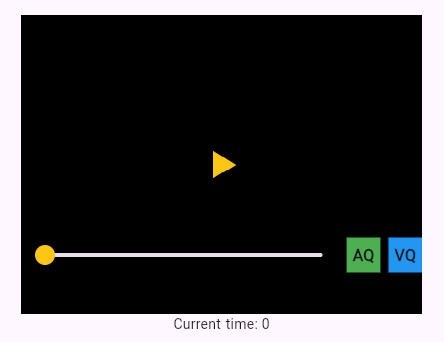
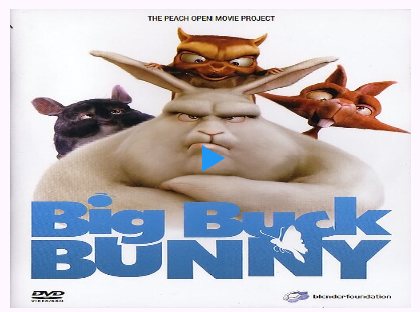
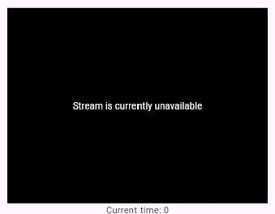
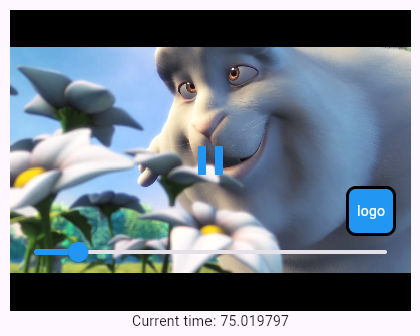

# UI Styling

The THEOplayer Flutter SDK is currently completely [ `chromeless` ](/doc/limitations.md), providing no default UI for the Player.
This means that you will have to create your own UI and implement it on top of the public APIs on the Flutter level.

We provide an [ `example` ](https://github.com/THEOplayer/flutter-theoplayer-sdk/tree/main/flutter_theoplayer_sdk/flutter_theoplayer_sdk/example) project within the THEOplayer
Flutter SDK that you can use as a template to understand how to setup a custom UI for the Player.

## Table of Contents

* [Getting started](#getting-started)
* [Adding/removing buttons](#addingremoving-buttons)
* [Adding a poster image](#adding-a-poster-image)
* [Stream unavailable message](#stream-unavailable-message)
* [Logo Overlay](#logo-overlay)
* [More information](#more-information)

## Getting started

Go into the `lib` subdirectory within the THEOplayer Flutter SDK [ `example` ](https://github.com/THEOplayer/flutter-theoplayer-sdk/tree/main/flutter_theoplayer_sdk/flutter_theoplayer_sdk/example)
project and you will see the `player_widgets` folder, which contains widgets used to create a custom Player UI. To quickly get started, copy and paste the `player_widgets` folder into your own
project and review how its initialized within the `main.dart` file of the example project.

You can also copy and paste the `helpers` folder, which contains a `utils.dart` file that will allow you to update the example Player's color, into your project. You can remove the default `theoYellow` color variable and add your own. 

> Note that you will also have to update the `theoYellow` variable references within the `player_widgets` folder to your own.

Once done, your Player will appear in your application like this:



The sections below assume that you've followed the steps listed in this section to implement your custom Player UI.

## Adding/removing buttons

To add another button to the Player UI, go to the `player_ui_widget.dart` file located in the `player_widgets` folder.
First import your custom widget button and then within the `PlayerUI` build method's return, place your item into the `children` array based on where you want it to appear.

If you want to add a new button to overlay the top of the Player, your code will look like this:

```dart
  @override
  Widget build(BuildContext context) {
    return Column(
      children: [
        Align(
          // add your widget to the top of the player's container here
          alignment: Alignment.topCenter,
          // child: {Add your widget here}
        ),
        Expanded(child: Container()),
        Align(
          // add your widget to the center of the player's container here
          alignment: Alignment.center,
          child: PlayButtonWidget(player: player)
        ),
        Expanded(
          child: Align(
            // add your widget to the bottom of the player's container here
            alignment: FractionalOffset.bottomCenter,
            child: Row(
              mainAxisAlignment: MainAxisAlignment.spaceBetween,
              children: [
                Expanded(child: SeekbarWidget(player: player, seekWhileDragging: false)),
                QualityChangeWidget(player: player),
              ],
            )
          ),
        ),
      ],
    );
  }
```

To remove a button from the Player UI, you can delete or comment out the widget from within the `PlayerUI` build method's return and do the same for its import statement.
Once done, the button will no longer appear in the Player's UI.

## Adding a poster image

To display a poster image before your stream initially starts instead of having the default black screen, you must create your own custom widget.
To begin, in the `player_widgets` folder you will need to create a `poster_widget.dart` file that will contain the poster widget.

Traditionally, a poster is only shown once before the stream initially starts. To implement this type of functionality, implement the following code in the `poster_widget.dart` file:

<details>

<summary>
  <b>Poster Widget Code</b>
</summary>

```dart
import 'package:flutter/material.dart';
import 'package:theoplayer/theoplayer.dart';

class PosterWidget extends StatefulWidget {
  const PosterWidget({
    super.key,
    required this.player, // require a player instance be passed in
    required this.posterUrl, // require a poster URL be passed in to
  });

  // set the variables to make them usable in your dart file
  final THEOplayer player;
  final dynamic posterUrl;

  @override
  State<StatefulWidget> createState() {
    return _PosterWidgetState();
  }
}

class _PosterWidgetState extends State<PosterWidget> {
  // create a 'hasPlayed' variable to track when the player has not started the stream at all
  bool hasPlayed = false;
  @override
  void initState() {
    super.initState();
    // use the 'played' property on the player instance to check if the stream has ever played
    // the played property will return an empty array if the stream has not been started since the page loaded
    hasPlayed = widget.player.played.isNotEmpty;

    // you can then listen for player 'play' or 'playing' events to know when to hide the poster
    widget.player.addEventListener(PlayerEventTypes.PLAY, playEventListener);
    widget.player
        .addEventListener(PlayerEventTypes.PLAYING, playingEventListener);
  }

  void playEventListener(Event event) {
    setState(() {
      hasPlayed = true;
    });
  }

  void playingEventListener(Event event) {
    setState(() {
      hasPlayed = true;
    });
  }

  @override
  Widget build(BuildContext context) {
    // conditionally show the poster if the stream has never been played since the player loaded
    return !hasPlayed
        ? Container(
            width: double.infinity,
            height: double.infinity,
            // for poster images hosted on the internet, use Image.network as shown below:
            child: Image.network(widget.posterUrl, fit: BoxFit.fill),

            // for poster images hosted locally in your assets folder, use AssetImage as shown below:
            // note - you will also have to add your local image assets to the pubspec.yaml file to use them
            // decoration: const BoxDecoration(
            //   image: DecorationImage(
            //     image: AssetImage('assets/images/your-poster.png'),
            //     fit: BoxFit.cover, // Adjust fit as needed
            //   ),
            // ),
          )
        : Container();
  }

// remove event listeners from the player when the poster is no longer shown
  @override
  void dispose() {
    widget.player.removeEventListener(PlayerEventTypes.PLAY, playEventListener);
    widget.player
        .removeEventListener(PlayerEventTypes.PLAYING, playingEventListener);
    super.dispose();
  }
}
```

</details>

Once you have your poster widget created, you then want to have it appear above everything except the play button. To do this
you will need to use a [ `Stack widget` ](https://api.flutter.dev/flutter/widgets/Stack-class.html) to overlap children widgets in the
`player_ui_widget.dart` file's build method return. Here is an example:

<details>

<summary>
  <b>Display Poster Widget in Player UI Code</b>
</summary>

```dart
  @override
  Widget build(BuildContext context) {
    return Stack(
      alignment: Alignment.center,
      children: [
        Column(
          children: [
            Expanded(child: Container()),
            Expanded(
              child: Align(
                  alignment: FractionalOffset.bottomCenter,
                  child: Row(
                    mainAxisAlignment: MainAxisAlignment.spaceBetween,
                    children: [
                      Expanded(
                          child: SeekbarWidget(
                        player: player,
                        seekWhileDragging: false,
                      )),
                    ],
                  )),
            ),
          ],
        ),
        // ensure poster appears below the play button, but above the other control widgets
        Align(
          alignment: Alignment.center,
          child: PosterWidget(
            posterUrl: 'https://upload.wikimedia.org/wikipedia/commons/thumb/2/27/Blender3D_vorderseite_big_bug.jpg/500px-Blender3D_vorderseite_big_bug.jpg?20080528210017',
            player: player), // pass in if using remotely hosted image asset with Image.network()
        ),
        // ensure play button appears over everything else
        Align(
            alignment: Alignment.center,
            child: PlayButtonWidget(player: player)),
        Align(
          alignment: Alignment.bottomRight,
          child: LogoOverlayWidget(player: player),
        ),
      ],
    );
  }
```

</details>

The new layout will allow your poster to appear below the play button. You can shift the widgets around to deliver the experience you want.

After following the steps outlined above, your player will display a poster before the stream initially starts like this:



## Stream unavailable message

To add a unavailable message to your streams, you should create a custom widget and conditionally render it when the player encounters an error that prevents it from showing a stream.
Within the `player_widgets` folder create a `error_handling_widget.dart` file that will contain a custom widget for handling errors.

Within the widget, you must add an event listener to your Player instance to check for errors. When an error occurs, you can either display the
specific error message using the `error` property on your player instance, a custom message passed to the widget, or a predefined message.

Here is an example:

<details>

<summary>
  <b>Error Handling Widget Code</b>
</summary>

```dart
import 'package:flutter/material.dart';
import 'package:theoplayer/theoplayer.dart';

class ErrorHandlingWidget extends StatefulWidget {
  const ErrorHandlingWidget({
    super.key,
    required this.player,
    // optional custom error message string can be passed to the widget to display for all or specific errors
    this.errorMessage,
  });

  final THEOplayer player;
  final dynamic errorMessage;

  @override
  State<StatefulWidget> createState() {
    return _ErrorHandlingWidgetState();
  }
}

class _ErrorHandlingWidgetState extends State<ErrorHandlingWidget> {
  bool streamError = false;
  @override
  void initState() {
    super.initState();
    streamError = widget.player.error != null;
    widget.player.addEventListener(PlayerEventTypes.ERROR, errorEventListener);
  }

  void errorEventListener(Event event) {
    setState(() {
      streamError = widget.player.error != null;
    });
  }

  @override
  Widget build(BuildContext context) {
    return streamError
        ? Container(
            alignment: Alignment.center,
            color: Colors.black,
            width: double.infinity,
            height: double.infinity,
            // decoration: const BoxDecoration(
            // image: DecorationImage(
            //   image: AssetImage('assets/images/background.png'), // to use a locally hosted asset folder image
            // or
            //   image: NetworkImage('https://example.com/background.jpg') // to use a remotely hosted image
            //   fit: BoxFit.cover, // adjusts how the image fills the container
            //   ),
            // ),
            child: Text(
                // widget.errorMessage ?? 'Your stream is currently unavailable', // use custom error message or predefined message

                widget.player.error ?? 'Your stream is currently unavailable', // use error message returned from the player or predefined message
                
                style: const TextStyle(color: Colors.white)), // change the text color
          )
        : const SizedBox.shrink();
  }

  @override
  void dispose() {
    widget.player
        .removeEventListener(PlayerEventTypes.ERROR, errorEventListener);
    super.dispose();
  }
}
```

</details>

This widget will now conditionally render with your desired message when an error occurs. You can tweak the code to listen for specific errors
and display your own specific responses for each.

Next, you can ensure your message appears over everything else by updating the layout in the `player_ui_widget.dart` file and putting the error
handling widget as the last child to appear over everything else.

<details>

<summary>
  <b>Display Error Handling Widget in Player UI Code</b>
</summary>

```dart
  @override
  Widget build(BuildContext context) {
    return Stack(
      alignment: Alignment.center,
      children: [
        Column(
          children: [
            Expanded(child: Container()),
            Align(
                alignment: Alignment.center,
                child: PlayButtonWidget(player: player)),
            Expanded(
              child: Align(
                  alignment: FractionalOffset.bottomCenter,
                  child: Row(
                    mainAxisAlignment: MainAxisAlignment.spaceBetween,
                    children: [
                      Expanded(
                          child: SeekbarWidget(
                        player: player,
                        seekWhileDragging: false,
                      )),
                    ],
                  )),
            ),
          ],
        ),
        Align(
          alignment: Alignment.bottomRight,
          child: LogoOverlayWidget(player: player),
        ),
        // last child displays over everything else
        Align(
          alignment: Alignment.center,
          child: ErrorHandlingWidget(player: player, errorMessage: 'Stream is currently unavailable',),
        )
      ],
    );
  }
```

</details>

Once implementing the code above you will see your error handling widget appear whenever an error occurs. Your error handling widget will display like this:



## Logo overlay

To add a logo overlay to your stream you will have to make a custom widget that can be added to the `PlayerUI` build method in the `player_ui_widget.dart` file.
You can use the `play_button_widget.dart` file as an example of how to conditionally render a widget based on the player's state.

First create a `logo_overlay_widget.dart` file within the `player_widgets` folder and then create a stateful widget within it. The stateful widget will accept a player parameter
that can be used to track changes to the player's state. Your code will look like the following:

```dart
import 'package:flutter/material.dart';
import 'package:theoplayer/theoplayer.dart';
import 'package:theoplayer_example/helpers/utils.dart';

class LogoOverlayWidget extends StatefulWidget {
  const LogoOverlayWidget({
    super.key,
    required this.player,
  });

  final THEOplayer player;

  @override
  State<StatefulWidget> createState() {
    return _LogoOverlayWidgetState();
  }
}
```

Next, you will have to create a state class for the `LogoOverlay` widget and set event listeners to track changes to the player using the
player instance passed into the widget. Within the build method, you can customize the widget code to overlay your stream with
text, an image, a shape, or mix it up. In the following example, a box shape overlay with logo text is created:

<details>

<summary>
  <b>Logo Overlay State Code</b>
</summary>

```dart
class _LogoOverlayWidgetState extends State<LogoOverlayWidget> {
  bool playing = false;

  @override
  void initState() {
    super.initState();
    playing = !widget.player.isPaused;
    widget.player.addEventListener(PlayerEventTypes.PLAY, playEventListener);
    widget.player
        .addEventListener(PlayerEventTypes.PLAYING, playingEventListener);
    widget.player.addEventListener(PlayerEventTypes.PAUSE, pauseEventListener);
  }

  void playEventListener(Event event) {
    setState(() {
      playing = true;
    });
  }

  void playingEventListener(Event event) {
    setState(() {
      playing = true;
    });
  }

  void pauseEventListener(Event event) {
    setState(() {
      playing = false;
    });
  }

  @override
  Widget build(BuildContext context) {
    return playing
        ? Container(
            margin: EdgeInsets.only(right: 15.0, bottom: 75.0),
            width: 50.0,
            height: 50.0,
            decoration: BoxDecoration(
              color: Colors.blue, // set the color of the box
              borderRadius: BorderRadius.circular(10.0), // add rounded corners
              border: Border.all( // add a border
                color: Colors.black,
                width: 3.0,
              ),
            ),
            child: Center(
              child: Text(
                'logo',
                style: TextStyle(color: Colors.white),
              ),
            ),
          )
        : Container();
  }

  @override
  void dispose() {
    widget.player.removeEventListener(PlayerEventTypes.PLAY, playEventListener);
    widget.player
        .removeEventListener(PlayerEventTypes.PLAYING, playingEventListener);
    widget.player
        .removeEventListener(PlayerEventTypes.PAUSE, pauseEventListener);
    super.dispose();
  }
}
```

</details>

This code allows the logo overlay to display on the player while the stream is playing and be hidden when the stream is paused.

In the `player_ui_widget.dart` file, you can import `logo_overlay_widget` and then add it within the build method.

To have the logo overlay appear on the bottom right of the player without disrupting the layout, you can add the following code to replace the `player_ui_widget.dart` file's build method return:

<details>

<summary>
  <b>Add Logo Overlay to Player UI Code</b>
</summary>

```dart
     @override
  Widget build(BuildContext context) {
    return Stack(
      alignment: Alignment.center,
      children: [
        Column(
          children: [
            Expanded(child: Container()),
            Align(
                alignment: Alignment.center,
                child: PlayButtonWidget(player: player)),
            Expanded(
              child: Align(
                  alignment: FractionalOffset.bottomCenter,
                  child: Row(
                    mainAxisAlignment: MainAxisAlignment.spaceBetween,
                    children: [
                      Expanded(
                          child: SeekbarWidget(
                        player: player,
                        seekWhileDragging: false,
                      )),
                    ],
                  )),
            ),
          ],
        ),
        Align(
          alignment: Alignment.bottomRight,
          child: LogoOverlayWidget(player: player),
        ),
      ],
    );
  }
```

</details>

After following the steps above, you will should see the following upon pressing play on your Player:



> Note: the logo overlay can be customized to display when different Player events occur by modifying the event listeners and changing the `logo_overlay_widget` file's state logic.

## More information

* [THEOplayer Flutter SDK](https://github.com/THEOplayer/flutter-theoplayer-sdk)
